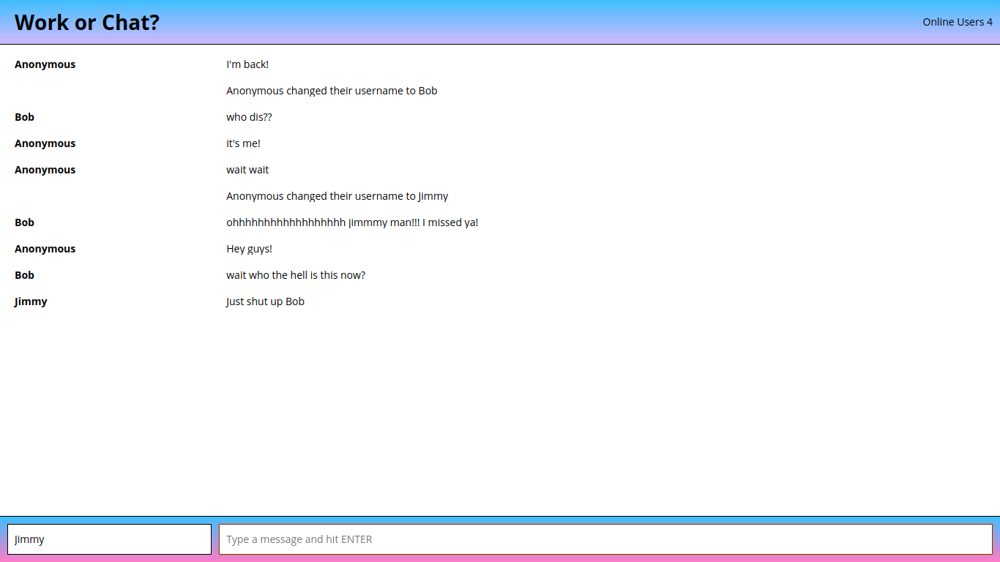

Chatty
============================

A minimal chatroom app where users can see the number of online users in the chatroom, send each other messages and change their username. A user can also change their username which will trigger a status update to all connected users in the main chat window.


### Dependencies

Install the dependencies and start the server.

```
npm install
npm start
open http://localhost:3000
```

* React
* React-dom
* Webpack
* [babel-loader](https://github.com/babel/babel-loader)
* [babel-preset-es2015]
* [babel-preset-react]
* css-loader
* node-sass
* sass-loader
* sockjs-client
* style-loader
* webpack
* [webpack-dev-server](https://github.com/webpack/webpack-dev-server)


### Screenshots

